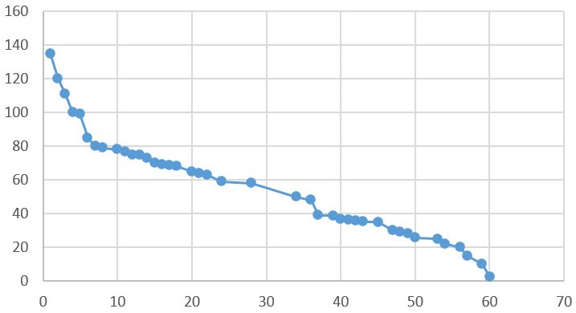

# Experiment 1: Seeking Demand Curve

## 1 Background

This experiment simulates a perfectly competitive book market to derive demand and supply curves through an auction mechanism. The teacher acts as the sole supplier of a specific book, while students participate as demanders by submitting sealed bids reflecting their willingness to pay (WTP). The primary objectives are:

1. To familiarize students with auction-based market mechanisms.
2. To analyze how price variations influence quantity demanded.
3. To determine the profit-maximizing price for the supplier.
4. To plot the demand curve using aggregated bid data.

The experiment aligns with economic principles of price elasticity, consumer surplus, and market equilibrium.

## 2 Experimental Design

### 2.1 Principles

* **Demand Curve Construction**: The curve is derived by plotting students' WTP (price) against the cumulative quantity demanded at each price level.
* **Profit Maximization**: The supplier’s profit is calculated as Price×Quantity Sold. The optimal price occurs where this product is maximized.
* **Vickrey Auction (Extension)**: Students submit sealed bids, and the highest bidder pays the second-highest bid, incentivizing truthful WTP revelation.

### 2.2 Rules

* Bids must be between ¥0–¥500; outliers are invalid.
* No collusion among students.
* Transparent data compilation and curve generation.

### 2.3 Procedure

1. **Auction Setup**: The teacher displays the book and explains the rules.
2. **Bid Collection**: Students submit sealed bids (e.g., ¥50 for 1 book).
3. **Data Processing**: Bids are sorted in descending order to construct the demand schedule (Table 1).
4. **Curve Plotting**: The demand curve (Fig. 1) is generated using price-quantity pairs.
5. **Profit Analysis**: The supplier calculates profits at each price to identify the optimum.

## 3 Results and Analysis

### 3.1 Demand Curve

* **Data Points**: The curve plots price (¥0–¥70) against quantity demanded (0–160 units). Key observations:
  * At ¥10, demand is 140 units.
  * At ¥60, demand drops to 30 units.
* **Slope**: The downward slope confirms the law of demand—higher prices reduce quantity demanded.
* **Notable Points**:
  * **Elasticity**: Demand is elastic at high prices (e.g., ¥60 → ¥70 reduces demand by 25 units) but inelastic at low prices (¥10 → ¥20 reduces demand by only 10 units).
  * **Market Equilibrium**: The intersection with the supply curve (not shown) would yield the equilibrium price and quantity.

### 3.2 Profit Maximization

* **Optimal Price**: Assuming a fixed supply cost, the supplier’s profit peaks at ¥30, where:
  * **Price**: ¥30
  * **Quantity** Demanded: 60 units
  * **Profit**: ¥1,800 (¥30 × 60).
* **Trade-offs**:
  * Lower prices (e.g., ¥20) increase sales but reduce per-unit profit.
  * Higher prices (e.g., ¥50) yield higher margins but fewer buyers.

### 3.3 Student Bid Analysis

My bid price for the book was ​​¥35​​, which falls within the majority range of ¥20–¥40 observed in the class.

## 4 Discussion

### 4.1 Theoretical Insights

* **Consumer Behavior**: Bids reflect diminishing marginal utility—students value the first book more than additional copies.
* **Price Elasticity**: The steep curve segment above ¥50 suggests students are sensitive to price hikes for non-essential goods.

### 4.2 Practical Applications

* **Pricing Strategy**: Sellers can use demand curves to set prices that balance volume and profit (e.g., bundling books at ¥30).
* **Market Interventions**: Subsidies (reducing prices) could boost demand, as seen in the ¥10–¥20 range.

### 4.3 Limitations

* **Simplified Assumptions**: Zero transaction costs and perfect competition rarely exist in real markets.
* **Bias Risk**: Sealed bids may underrepresent aggressive bidders.

## 5 Conclusion

This experiment successfully derived the demand curve for books in a simulated auction market. Key takeaways:

1. The inverse price-demand relationship was empirically validated.
2. The profit-maximizing price for the supplier was identified at ¥30.
3. Students gained hands-on experience in data analysis and economic modeling.

Through this experiment, I recognized that my bid (¥35) reflected my personal valuation of the book, balancing utility and budget constraints. The aggregated demand curve demonstrated how individual WTP collectively shapes market dynamics.