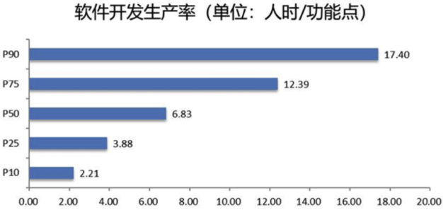

# Experiment 2: Cost Estimation of Software Project

## Part I: Software Size Measurement

### 1 Experiment Background and Objectives

Software size measurement is a fundamental step in software engineering management, cost estimation, and economic evaluation. This experiment applies function point analysis to the course project of "Software Engineering Management and Economics" to assess the system size from a user perspective and provide a basis for subsequent effort estimation and cost control.

The function point method is a size measurement technique independent of programming languages and development technologies, capable of objectively reflecting the functional complexity of software systems. This experiment adopts the **NESMA Detailed Method** as the primary function point analysis approach, with the **NESMA Estimated Method** used for verification and comparison.

### 2 Experiment Content and Steps

#### 2.1 Determine the Engineering Type of the Software System

The project belongs to an enterprise-level application system, specifically:

**Type**: Hybrid (Data-Intensive + Transaction-Intensive)

**Characteristics**:

* Core functionalities revolve around dataset management (upload, download, delete, access control) and automated operations (CI/CD, log monitoring).
* Relies on cloud services (Alibaba Cloud OSS, Docker containerization), requiring handling of high-concurrency data access and complex transaction logic.

#### 2.2 Identify and Define System Boundaries and Scope

**System Boundaries**:

* **Internal**: Frontend (Vue.js), backend (Spring Boot), persistence layer (Alibaba Cloud OSS), and operations tools (Docker, GitHub Actions).
* **External**: External subsystems such as user authentication system, curtain wall vibration data detection and display system, and stone curtain wall stain detection System (interacting via RESTful APIs).

**Scope**:
  * **Core Features**:
    * Dataset management (upload/download/delete/export/access control).
    * Backup and recovery, log management.
    * CI/CD automated deployment.
  * **Exclusions**: Hardware device management, specific implementations of third-party subsystems.

#### 2.3 Function Point Analysis

##### 2.3.1 Data Function Points (ILF/EIF)

| Type | Logical File         | Data Elements (DET)                                                    | Record Elements (RET) | Complexity | Weight |
|------|----------------------|------------------------------------------------------------------------|-----------------------|------------|--------|
| ILF  | User Data            | username, password, role, email, permissions                           | 1                     | Low        | 7      |
| ILF  | Dataset Metadata     | filePath, size, uploadTime, owner, status, OSS path, encryption status | 1                     | Low        | 7      |
| ILF  | Operation Log        | timestamp, operation, user, result, IP address, affected data volume   | 2                     | Medium     | 10     |
| EIF  | External User System | userID, authToken, subsystem permissions, last login time              | 1                     | Low        | 5      |

##### 2.3.2 Transaction Function Points (EI/EO/EQ)

| Type | Transaction    | Data Elements (DET)                                                              | FTR | Complexity | Weight |
|------|----------------|----------------------------------------------------------------------------------|-----|------------|--------|
| EI   | Upload Dataset | File stream, target path, user credentials, encryption flag, metadata            | 2   | Medium     | 4      |
| EI   | Delete Dataset | File path, user credentials, operation reason                                    | 1   | Low        | 3      |
| EO   | Batch Export   | File list, user credentials, validity period, export format, compression options | 3   | High       | 7      |
| EQ   | Log Query      | Time range, operation type, userID, result status                                | 2   | Medium     | 4      |

#### 2.4 Measure Function Point Complexity

According to NESMA standards, function point complexity measurement must include the following elements:

##### 2.4.1 Internal Logical File (ILF) Complexity

| Logical File     | DET (Data Elements)                                                    | RET | Complexity | Weight |
|------------------|------------------------------------------------------------------------|-----|------------|--------|
| User Data        | username, password, role, email, permissions                           | 1   | Low        | 7      |
| Dataset Metadata | filePath, size, uploadTime, owner, status, OSS path, encryption status | 1   | Low        | 7      |
| Operation Log    | timestamp, operation, user, result, IP address, affected data volume   | 2   | Medium     | 10     |

##### 2.4.2 External Interface File (EIF) Complexity

| Logical File         | DET (Data Elements)                                       | RET | Complexity | Weight |
|----------------------|-----------------------------------------------------------|-----|------------|--------|
| External User System | userID, authToken, subsystem permissions, last login time | 1   | Low        | 5      |

##### 2.4.3 External Input (EI) Complexity

| Transaction    | DET (Input Data Elements)                                             | FTR | Complexity | Weight |
|----------------|-----------------------------------------------------------------------|-----|------------|--------|
| Upload Dataset | File stream, target path, user credentials, encryption flag, metadata | 2   | Medium     | 4      |
| Delete Dataset | File path, user credentials, operation reason                         | 1   | Low        | 3      |

##### 2.4.4 External Output (EO) Complexity

| Transaction  | DET (Output Data Elements)                                                       | FTR | Complexity | Weight |
|--------------|----------------------------------------------------------------------------------|-----|------------|--------|
| Batch Export | File list, user credentials, validity period, export format, compression options | 3   | High       | 7      |

##### 2.4.5 External Query (EQ) Complexity

| Transaction | DET (Query Conditions)                            | FTR | Complexity | Weight |
|-------------|---------------------------------------------------|-----|------------|--------|
| Log Query   | Time range, operation type, userID, result status | 2   | Medium     | 4      |

#### 2.5 NESMA Function Point Calculation

1. **Unadjusted Function Points (UFP)**

   Data Function Points (29) + Transaction Function Points (18) = **47 FP**

   * Data Function Points:

     | Type      | Component            | Count | Weight | Subtotal |
     |-----------|----------------------|-------|--------|----------|
     | ILF       | User Data            | 1     | 7      | 7        |
     | ILF       | Dataset Metadata     | 1     | 7      | 7        |
     | ILF       | Operation Log        | 1     | 10     | 10       |
     | EIF       | External User System | 1     | 5      | 5        |
     | **Total** |                      |       |        | **29**   |

   * Transaction Function Points:

     | Type      | Component      | Count | Weight | Subtotal |
     |-----------|----------------|-------|--------|----------|
     | EI        | Upload Dataset | 1     | 4      | 4        |
     | EI        | Delete Dataset | 1     | 3      | 3        |
     | EO        | Batch Export   | 1     | 7      | 7        |
     | EQ        | Log Query      | 1     | 4      | 4        |
     | **Total** |                |       |        | **18**   |

2. **Adjustment Factor Calculation**

   Based on 14 GSC factor ratings:

   | No. | GSC Factor                  | Rating | Rationale                                                                                |
   |-----|-----------------------------|--------|------------------------------------------------------------------------------------------|
   | 1   | Data Communication          | 3      | RESTful API interactions with external systems, but no real-time sync required           |
   | 2   | Distributed Data Processing | 0      | Processing data through distributed methods                                              |
   | 3   | Performance Requirements    | 3      | Supports 100+ concurrent requests with <2s response time                                 |
   | 4   | Hardware Constraints        | 2      | Standard cloud server configuration (4 cores, 8GB RAM), no special hardware dependencies |
   | 5   | Transaction Frequency       | 3      | 500+ dataset operations daily, concentrated during working hours                         |
   | 6   | Online Data Entry           | 3      | 100% operations via web interface                                                        |
   | 7   | End-User Efficiency         | 3      | Batch export/template download features reduce repetitive tasks                          |
   | 8   | Online Updates              | 3      | Real-time metadata and permission updates, but no hot-patching required                  |
   | 9   | Complex Processing Logic    | 2      | Basic permission checks and AES-256 encryption, no complex algorithms                    |
   | 10  | Code Reusability            | 1      | New development with no reusable components                                              |
   | 11  | Ease of Installation        | 2      | Docker standard deployment, but manual OSS access key configuration required             |
   | 12  | Ease of Operation           | 3      | UI optimized for non-technical users, includes operation guides                          |
   | 13  | Multi-Site Deployment       | 1      | Single-region deployment (East China 1)                                                  |
   | 14  | Change Adaptability         | 2      | Requirement changes require API and database schema modifications                        |

   * **Total Degree of Influence (TDI)** = 3 + 0 + 3 + 2 + 3 + 3 + 3 + 3 + 2 + 1 + 2 + 3 + 1 + 2 = **30**
   * **Value Adjustment Factor (VAF)** = 0.65 + (0.01 × 30) = **0.95**
   * **Adjusted Function Points (AFP)** = 47 (UFP) × 0.95 = 44.65 ≈ **45 FP**

### 3 Experiment Results and Analysis

#### 3.1 NESMA Detailed Method Results

| Metric                      | Result            | Description                                                       |
|-----------------------------|-------------------|-------------------------------------------------------------------|
| **Unadjusted FP (UFP)**     | 47 FP             | Data FP (29) + Transaction FP (18)                                |
| **Adjustment Factor (VAF)** | 0.95              | Based on 14 GSC factors (TDI=30)                                  |
| **Adjusted FP (AFP)**       | 45 FP             | 47 × 0.95 = 44.65 (Rounded to nearest integer)                    |
| **Estimated Effort**        | 6.9 person-months | Industry average productivity of 6.5 FP/person-month (45÷6.5≈6.9) |

#### 3.2 NESMA Estimated Method Validation

##### 3.2.1 Function Point Detailed Count

| Function Type | Component            | Count | Default Weight | FP Subtotal |
|---------------|----------------------|-------|----------------|-------------|
| ILF           | User Data            | 1     | 7              | 7           |
| ILF           | Dataset Metadata     | 1     | 7              | 7           |
| ILF           | Operation Log        | 1     | 7              | 7           |
| EIF           | External User System | 1     | 5              | 5           |
| EI            | Upload Dataset       | 1     | 4              | 4           |
| EI            | Delete Dataset       | 1     | 4              | 4           |
| EO            | Batch Export         | 1     | 5              | 5           |
| EQ            | Log Query            | 1     | 4              | 4           |
| **Total**     |                      |       |                | **43 FP**   |

**Adjusted FP**: 43 × 0.95 (same VAF) = 40.85 FP ≈ **41 FP**

##### 3.2.2 Key Calculation Notes

* **Complexity Assumption Differences**:
  * Operation log forced to low complexity (7 FP) in Estimated method, but actual RET=2 should be medium (10 FP)
  * Batch export defaulted to medium complexity (5 FP), but actual 3 FTRs elevate it to high (7 FP)
* **Deviation Analysis**:

  $$
  \text{Absolute Deviation} = \frac{45\ \text{(Detailed)} - 41\ \text{(Estimated)}}{45} \times 100\% = 8.9\%
  $$

  Within NESMA Estimated method's ±10% tolerance

* **Calibration Recommendations**:
  Override default weights when:
  * EO/EO involves ≥3 FTRs → Force high complexity
  * ILF with RET≥2 → At least medium complexity

#### 3.3 Method Comparison

| Comparison Dimension | Estimated Method                             | Detailed Method                           | Recommended Use Case                              |
|----------------------|----------------------------------------------|-------------------------------------------|---------------------------------------------------|
| Counting Speed       | Fast (1-2 person-hours)                      | Slow (4-8 person-hours)                   | Use Estimated for frequent requirement changes    |
| Accuracy Range       | ±10%                                         | ±5%                                       | Detailed required for contract pricing            |
| Input Requirements   | Only function list                           | Full DET/RET/FTR definitions              | Estimated suitable for early Agile iterations     |
| Cloud Service Impact | Cannot differentiate local vs. cloud storage | Can mark cloud storage as high complexity | Detailed recommended for cloud-native projects    |
| Transaction Handling | All EI=4, EO=5, EQ=4                         | Graded by actual FTR count                | Critical transactions require Detailed validation |

#### 3.4 Core Differences Analysis

##### 3.4.1 Complexity Handling Logic

* **Estimated Method**:

  ```python
  def get_weight(func_type):
      return {"ILF":7, "EIF":5, "EI":4, "EO":5, "EQ":4}[func_type]  ## Hardcoded weights
  ```

* **Detailed Method**:

  ```python
  def get_weight(func_type, det, ret_ftr):
      if func_type == "ILF":
          return 7 if (det<=19 and ret<=1) else 10  ## Dynamic determination
  ```

##### 3.4.2 Requirement Documentation Dependency

* **Estimated**: Only needs function list (e.g., "Log Query" as a noun)
* **Detailed**: Requires field-level definitions (e.g., log query must specify time range, userID, etc.)

##### 3.4.3 Change Response Cost

| Change Type       | Estimated Adjustment | Detailed Adjustment              |
|-------------------|----------------------|----------------------------------|
| Add one EI        | +4 FP                | +3~6 FP (re-evaluate complexity) |
| Modify ILF fields | No adjustment        | May trigger complexity upgrade   |

### 4 Experiment Discussion

Through this experiment, I gained a deeper understanding of function point analysis in software size measurement, particularly in applying and comparing the NESMA Detailed and Estimated methods. Key takeaways:

1. **Theory-Practice Integration**: Applying NESMA to a real project highlighted that function point analysis is not just mathematical but requires contextual judgment based on project background and user needs.
2. **Detailed vs. Estimated Method Trade-offs**: The Estimated method is efficient but limited in complexity accuracy, while the Detailed method is precise but time-consuming. The choice depends on project phase and requirements stability.
3. **Adjustment Factor Significance**: Scoring 14 GSC factors demonstrated how non-functional requirements (e.g., performance, usability) quantitatively impact project size and cost.
4. **Cloud Service Implications**: Modern cloud-native architectures (e.g., Alibaba Cloud OSS, Docker) necessitate special attention to distributed data and external interfaces in function point analysis.
5. **Continuous Improvement Mindset**: Deviation analysis and calibration recommendations reinforced the importance of iterative refinement in cost estimation methodologies.

### 5 Experiment Conclusion

The function point analysis using the NESMA Detailed Method provided a systematic approach to measuring the software size of the enterprise-level application system. By categorizing components into Internal Logical Files (ILFs), External Interface Files (EIFs), and transaction functions (EI, EO, EQ), the analysis yielded an unadjusted function point count of 47 FP, which was adjusted to 45 FP after applying the Value Adjustment Factor (VAF = 0.95). The NESMA Estimated Method validation resulted in 41 FP, demonstrating an acceptable deviation of 8.9%, within the ±10% tolerance range.

Key insights from this experiment include the importance of contextual judgment in complexity assessment, particularly for cloud-native architectures (e.g., Alibaba Cloud OSS integration). The comparison between Detailed and Estimated methods highlighted trade-offs: the Detailed Method offers higher accuracy (±5%) but requires exhaustive documentation, while the Estimated Method is faster but less precise, making it suitable for agile iterations. The experiment also underscored the impact of non-functional requirements (e.g., performance, usability) on the adjustment factor, emphasizing their role in cost estimation.

## Part II: Software Cost Estimation

### 1 Experiment Background and Objectives

This experiment aims to perform comprehensive software cost estimation based on the function point analysis results of the "Software Engineering Management and Economics" course project. By combining functional size with industry benchmarks, it establishes a systematic approach from effort estimation to comprehensive labor and non-labor cost calculations. Specific goals include:

1. Mastering FP-to-effort (person-month) conversion methods
2. Applying industry productivity standards (HH/FP) and labor rates (¥/person-month)
3. Adjusting costs based on system characteristics (development language, team size, etc.)
4. Estimating direct non-labor costs (cloud services, servers, etc.)
5. Validating results to provide economic foundations for project management

### 2 Experiment Content and Steps

* **Function Point Analysis (FPA)**:
  * NESMA Detailed method yields **45 FP** (adjusted), with Estimated method validation at 41 FP (8.9% deviation, within tolerance).
* **Industry Benchmarks**:
  * References the 2024 China Software Industry Benchmark Data (CSBMK®-202410) for productivity and rate standards.
* **Effort Estimation**:
  * Total effort (person-hours) = FP × Productivity (HH/FP)
  * Person-months = Person-hours ÷ (Monthly working days × Daily effective hours)
* **Cost Adjustments**:
  * Adjust effort based on development language, team size, etc.
* **Non-Labor Costs**:
  * Includes cloud storage (Alibaba Cloud OSS), server rentals, etc.

#### 2.1 Obtain Software Size (FP)

* **Adjusted FP**: 45 FP (NESMA Detailed, VAF=0.95)

#### 2.2 Select Productivity Standard (HH/FP)

Per 2024 China Software Industry Benchmark Data:

* Full-industry software development productivity benchmarks (person-hours/FP):

  | P10  | P25  | P50  | P75   | P90   |
  |------|------|------|-------|-------|
  | 2.21 | 3.88 | 6.83 | 12.39 | 17.40 |

  

* For realistic estimation, uses P25-P50 productivity range bounds:

  | Standard | Value (HH/FP) | Description         |
  |----------|---------------|---------------------|
  | P25      | 3.88          | High productivity   |
  | P50      | 6.83          | Median productivity |

#### 2.3 Calculate Effort and Calendar Time

* **Total Effort (Person-Hours)**:
  * Upper bound: 45 × 6.83 = **307.35 HH**
  * Lower bound: 45 × 3.88 = **174.60 HH**
* **Total Effort (Person-Months)** (22.5 days/month, 8 hours/day):
  * Team weekly working days:

  | Week      | Member 1 | Member 2 | Member 3 | Weekly Total |
  |-----------|----------|----------|----------|--------------|
  | 1         | 5        | 6        | 3        | 14           |
  | ...       | ...      | ...      | ...      | ...          |
  | 14        | 6        | 5        | 2        | 13           |
  | **Total** | 81       | 81       | 39       | 201          |

  * Upper bound: 307.35 ÷ (22.5 × 8) ≈ **1.71 person-months**
  * Lower bound: 174.60 ÷ (22.5 × 8) ≈ **0.97 person-months**

* **Average Daily Effort**
  * Total person-days = 201
  * Total person-hours = 307.35 HH (upper) / 174.60 HH (lower)
  * Avg. daily effort = Total person-hours ÷ Total person-days
    * Upper: 307.35 ÷ 201 ≈ 1.53 hours/person-day
    * Lower: 174.60 ÷ 201 ≈ 0.87 hours/person-day
* **Calendar Time (Months)**
  * Project duration = 14 weeks ≈ 3.23 months (14 ÷ 4.33 weeks/month)
* **Total Effort (Person-Months)**
  * Total effort = Total person-hours ÷ 180 hours/person-month
    * Upper: 307.35 ÷ 180 ≈ 1.71 person-months
    * Lower: 174.60 ÷ 180 ≈ 0.97 person-months

#### 2.4 System Characteristic Adjustments

| Adjustment Factor    | Value | Rationale                                   |
|----------------------|-------|---------------------------------------------|
| Application Domain   | 1.05  | Dataset & ops management platform           |
| Development Language | 0.95  | Spring Boot + Vue.js (efficient frameworks) |
| Team Size            | 0.95  | Small team (3), smooth collaboration        |
| Cloud Dependence     | 1.10  | Alibaba Cloud OSS, Docker integration       |
| Completeness Level   | 1.05  | Includes dev, testing, documentation        |
| **Total Adjustment** | 1.09  | 1.05 × 0.95 × 0.95 × 1.10 × 1.05 ≈ 1.09     |

- **Adjusted Effort (Person-Months)**:
  - Upper: 1.71 × 1.09 ≈ **1.86 person-months**
  - Lower: 0.97 × 1.09 ≈ **1.06 person-months**

#### 2.5 Labor Cost Estimation

- **Labor Rate**: Shanghai P50 standard **¥31,207/person-month**
- **Labor Cost**:
  - Upper: 1.86 × 31,207 ≈ **¥58,045.02**
  - Lower: 1.06 × 31,207 ≈ **¥33,079.42**

#### 2.6 Non-Labor Cost Estimation

| Item                         | Amount (¥)    |
|------------------------------|---------------|
| OSS Service (Alibaba Cloud)  | 1,315.46      |
| GPU Server (MatPool Cloud)   | 14,000        |
| Proxy Server (Tencent Cloud) | 360           |
| **Total**                    | **15,675.46** |

#### 2.7 Total Cost Estimation
| Cost Type          | Lower Bound (¥) | Upper Bound (¥) |
|--------------------|-----------------|-----------------|
| Labor Cost         | 33,079.42       | 58,045.02       |
| Non-Labor Cost     | 15,675.46       | 15,675.46       |
| **Total Cost**     | **48,754.88**   | **73,720.48**   |

### 3 Experiment Results and Analysis

| No. | Item                         | Upper Value | Lower Value | Unit             | Description                             |
|-----|------------------------------|-------------|-------------|------------------|-----------------------------------------|
| 1   | Software Size                | 45          | 45          | FP               | NESMA Detailed, VAF=0.95                |
| 2   | Productivity Standard        | 6.83        | 3.88        | HH/FP            | P25-P50 industry benchmarks             |
| 3   | Total Effort (HH)            | 307.35      | 174.60      | Person-hours     | 45 FP × Productivity                    |
| 4   | Total Effort (Person-Months) | 1.71        | 0.97        | Person-months    | 180 hours/person-month                  |
| 5   | Avg. Daily Effort            | 1.53        | 0.87        | Hours/person-day | Total HH ÷ 201 person-days              |
| 6   | Calendar Time                | 3.23        | 3.23        | Months           | 14-week project duration                |
| 7   | System Adjustment            | 1.09        | 1.09        | -                | 5-factor composite adjustment           |
| 8   | Adjusted Effort              | 1.86        | 1.06        | Person-months    | Effort × Adjustment                   |
| 9   | Labor Cost                   | 58,045.02   | 33,079.42   | ¥                | Shanghai P50 rate (¥31,207/person-month) |
| 10  | Non-Labor Cost               | 15,675.46   | 15,675.46   | ¥                | Fixed cloud service costs               |
| 11  | Total Cost                   | 73,720.48   | 48,754.88   | ¥                | Labor + Non-Labor                       |

### 4 Experiment Discussion

1. **FP-to-Cost Mapping**: Understood the full chain from technical size (FP) to economic metrics (cost), emphasizing productivity benchmarks' critical role.
2. **Adjustment Factor Impact**: Cloud dependence and team size significantly influence cost adjustments, warranting prioritization in project management.
3. **Regional Rate Variations**: Shanghai's high labor rates directly affect total costs, necessitating location-flexible benchmark selection.
4. **Cost Optimization**: Non-labor costs (~4.4% of upper bound) could be reduced through cloud resource optimization.

### 5 Experiment Conclusion

Based on the 45 FP size measurement, the cost estimation leveraged industry benchmarks (CSBMK®-202410) to derive effort and financial projections. Using P25 (3.88 HH/FP) to P50 (6.83 HH/FP) productivity standards, the total effort ranged from 174.60 to 307.35 person-hours, translating to 0.97–1.71 person-months. After applying a 1.09× adjustment factor (accounting for cloud dependence, team size, and domain complexity), the adjusted effort reached 1.06–1.86 person-months, with labor costs between ¥33,079.42 and ¥58,045.02 (Shanghai P50 rate). Non-labor costs (e.g., Alibaba Cloud OSS, GPU servers) added ¥15,675.46, resulting in a total project cost range of ¥48,754.88–¥73,720.48.

Critical takeaways include the dominance of labor costs (95.6% of upper-bound expenses) and the influence of regional labor rates on budgets. The experiment demonstrated how productivity benchmarks and adjustment factors refine estimates, while cloud service costs, though smaller in proportion, require optimization. Future improvements could involve dynamic productivity calibration (e.g., team skill adjustments) and cloud cost-monitoring tools to enhance accuracy. Overall, this exercise validated the linkage between technical metrics (FP) and economic outcomes, providing a foundation for project financial planning.